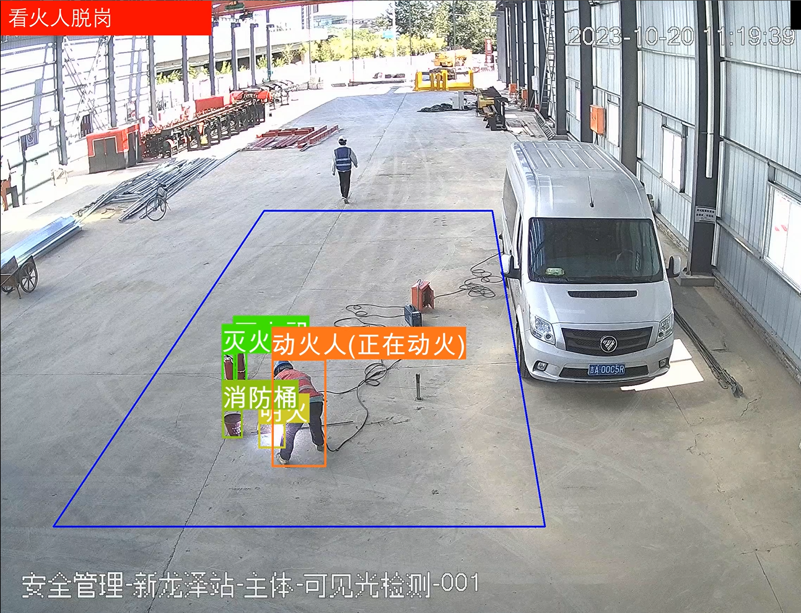
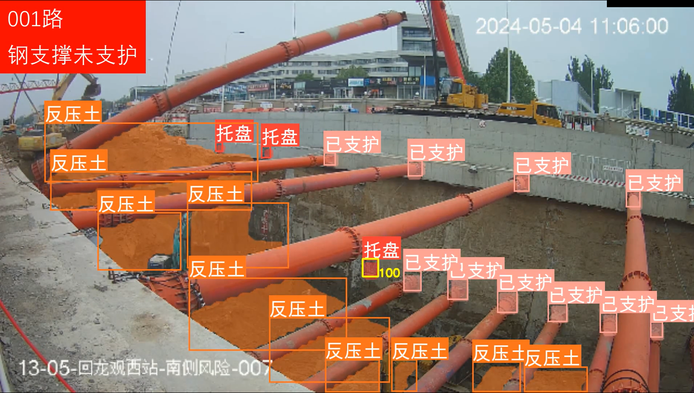
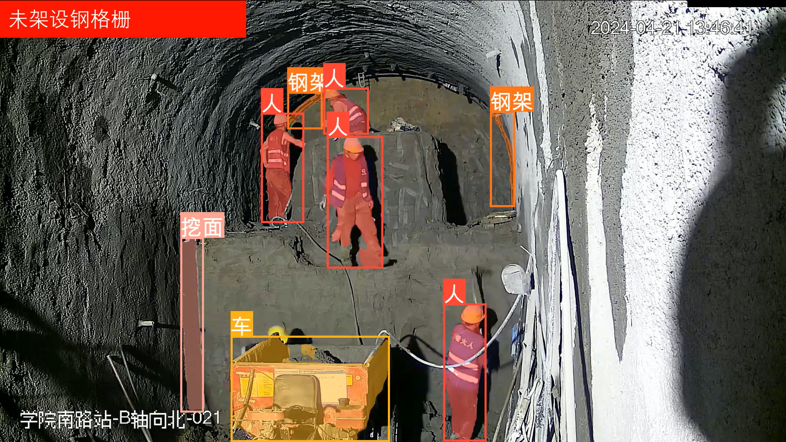
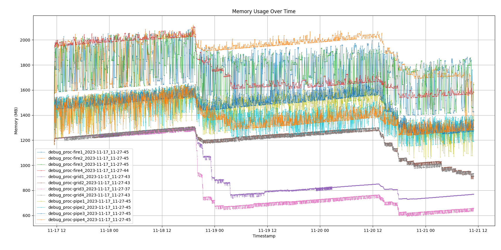
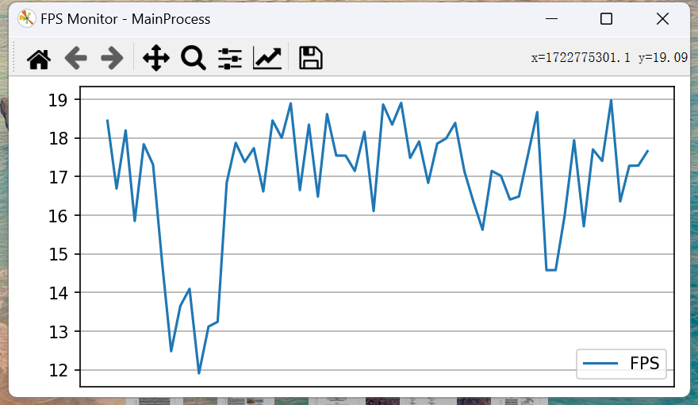

# BJSubway
城市轨道交通智慧工地视觉算法服务，来自北京市轨道交通公司

## Features
- 适用于事件识别和场景监测
- 实时警报和视频推流
- 精度与性能最优的目标检测和分割模型
- 可靠、通用和易扩展的系统服务
- 心跳机制的多进程监视和故障重启
- 适配多种应用场景

### 功能效果
<details>
<summary>点击展开/折叠</summary>

### 已开发场景
1. 动火场景


2. 明挖工程


3. 暗挖工程


### 性能监控
1. 内存使用


2. 处理帧率


</details>

## 依赖
Python package:
- Python >= 3.8
- OpenCV
- Pytorch

Software:
- ffmpeg
- EasyDarwin
- NodeJS & npm

## 安装
```
pip install -r requirements.txt
```

## Usage
1. 配置 properties.py 接入视频流地址和推流地址、第三方接入系统地址
2. 启动主程序：
    ```
    python main.py
    ```
- 测试预测视频：
```
python pred_video.py
```
- 训练模型：
```
python train.py
```

<!-- ## Contributing
Describe how others can contribute to the project. -->

<!-- ## License
Specify the license under which the project is distributed. -->

## 作者
Team 623 of Beijing Jiaotong University.
#### Contact: 13392406082@163.com

<!-- ## Acknowledgements
Give credit to any third-party resources or people who helped with the project. -->